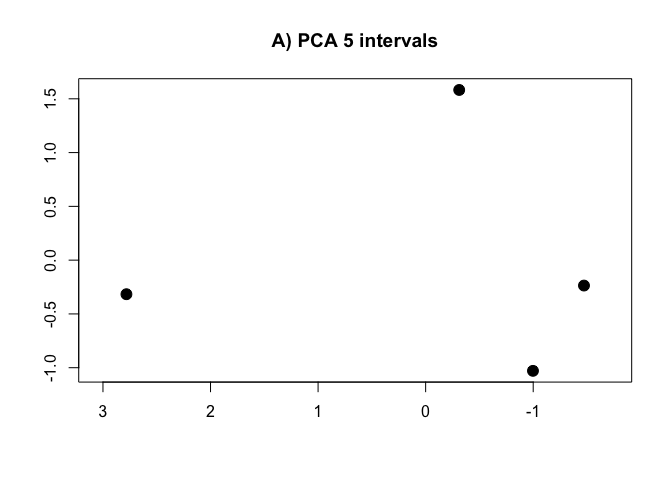
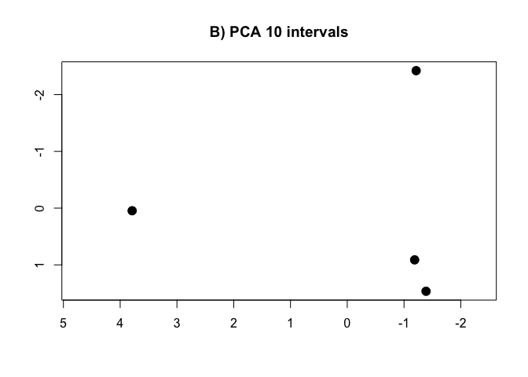
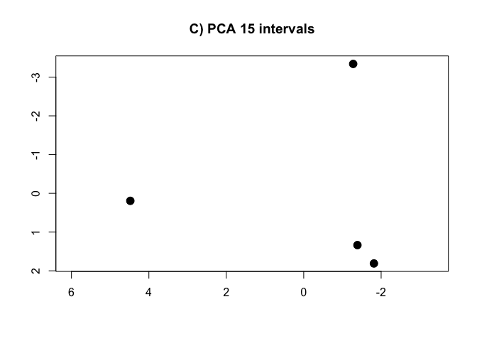
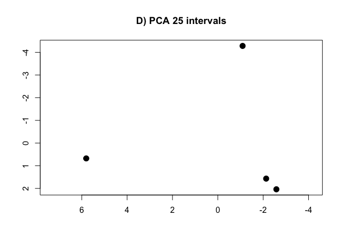
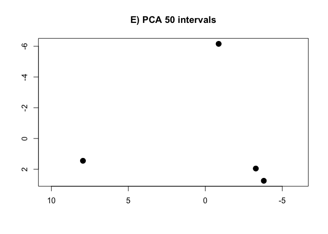
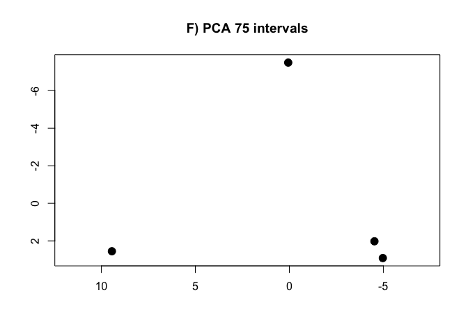
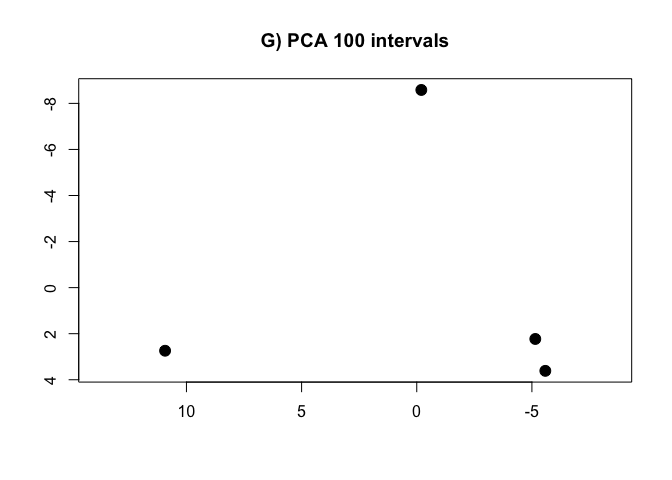
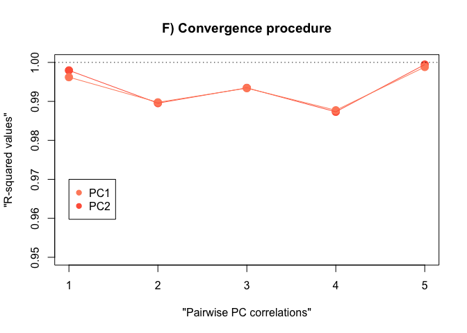

Intervals’ method tutorial Part2
================
Thomas Puschel and Jordi Marce-Nogue
2020-04-26T21:13:14-05:00

## Tutorial: How to use R to analyse data from FEA using the intervals’ method

# Part2: Convergence procedure to estimate an appropiate number of intervals

This script corresponds to the convergence procedure used to estimate an
appropiate number of interval variables. We have provided the different
files for the example using different numbers of intervals (i.e., N= 5,
10, 15, 25, 50, 75 and 100). When analysing your own data, you will need
to create your .csv files with different number of intervals by changing
the value of the ‘NIntervals’ object used in the previous tutorial (also
available as the “01-intervals-method-script” in
[figshare](https://figshare.com/articles/intervals-method-files_rar/12025866)
and then run the script for each one of the cases.

# 1\) Read all the files included in the convergence

``` r
#SCALE = T to use the correlation matrix
#SCALE = F to use the variance-covariance matrix

intervals.data.5 <- read.csv("matrix-of-intervals-5.csv", row.names = 1, header = TRUE, sep = ",")
intervals.data.10 <- read.csv("matrix-of-intervals-10.csv", row.names = 1, header = TRUE, sep = ",")
intervals.data.15 <- read.csv("matrix-of-intervals-15.csv", row.names = 1, header = TRUE, sep = ",")
intervals.data.25 <- read.csv("matrix-of-intervals-25.csv", row.names = 1, header = TRUE, sep = ",")
intervals.data.50 <- read.csv("matrix-of-intervals-50.csv", row.names = 1, header = TRUE, sep = ",")
intervals.data.75 <- read.csv("matrix-of-intervals-75.csv", row.names = 1, header = TRUE, sep = ",")
intervals.data.100 <- read.csv("matrix-of-intervals-100.csv", row.names = 1, header = TRUE, sep = ",")
```

# 2\) Compute PCAs for each one of the cases

``` r
PCA.5 <- prcomp(intervals.data.5[, 1:5], scale = T)
PCA.10 <- prcomp(intervals.data.10[, 1:10], scale = T)
PCA.15 <- prcomp(intervals.data.15[, 1:15], scale = T)
PCA.25 <- prcomp(intervals.data.25[, 1:25], scale = T)
PCA.50 <- prcomp(intervals.data.50[, 1:50], scale = T)
PCA.75 <- prcomp(intervals.data.75[, 1:75], scale = T)
PCA.100 <- prcomp(intervals.data.100[, 1:100], scale = T)
```

# 3\) Calculate te R-squared values for convergence procedure

PC1 convergence:

``` r
Rvalues.pc1 <- c(
  summary(lm(PCA.10$x[, 1] ~ PCA.15$x[, 1]))$r.squared,
  summary(lm(PCA.15$x[, 1] ~ PCA.25$x[, 1]))$r.squared,
  summary(lm(PCA.25$x[, 1] ~ PCA.50$x[, 1]))$r.squared,
  summary(lm(PCA.50$x[, 1] ~ PCA.75$x[, 1]))$r.squared,
  summary(lm(PCA.75$x[, 1] ~ PCA.100$x[, 1]))$r.squared
)
```

PC2 convergence:

``` r
Rvalues.pc2 <- c(
  summary(lm(PCA.10$x[, 2] ~ PCA.15$x[, 2]))$r.squared,
  summary(lm(PCA.15$x[, 2] ~ PCA.25$x[, 2]))$r.squared,
  summary(lm(PCA.25$x[, 2] ~ PCA.50$x[, 2]))$r.squared,
  summary(lm(PCA.50$x[, 2] ~ PCA.75$x[, 2]))$r.squared,
  summary(lm(PCA.75$x[, 2] ~ PCA.100$x[, 2]))$r.squared
)
```

Table with results: R-squared values

``` r
data.pca <- data.frame(Rvalues.pc1, Rvalues.pc2)
names(data.pca) <- c("PC1", "PC2")
rownames(data.pca) <- c("PCA 10 vs. PCA 15", "PCA 15 vs. PCA 25", "PCA 25 vs. PCA 50", "PCA 50 vs. PCA 75", "PCA 75 vs. PCA 100")

rm(intervals.data.5, intervals.data.10, intervals.data.15, intervals.data.25, intervals.data.50, intervals.data.75, intervals.data.100)
```

# 4\) Plot the PCAs and the R-squared values

<!-- --><!-- --><!-- --><!-- --><!-- --><!-- --><!-- --><!-- -->
